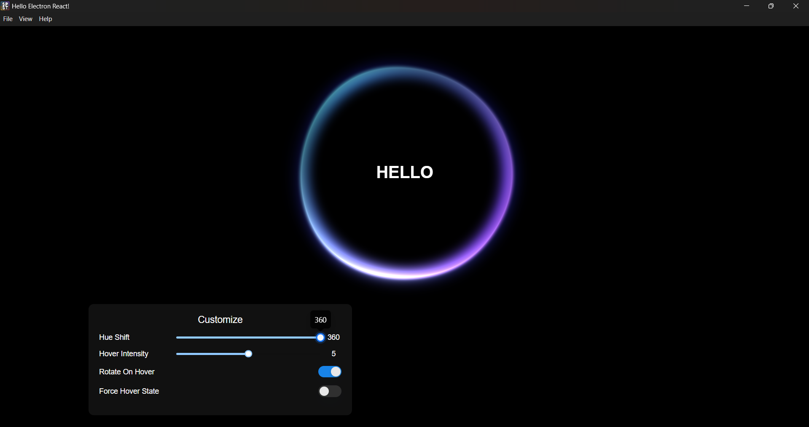
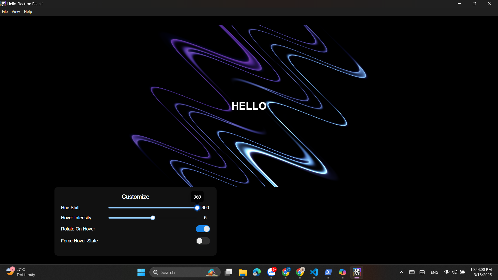
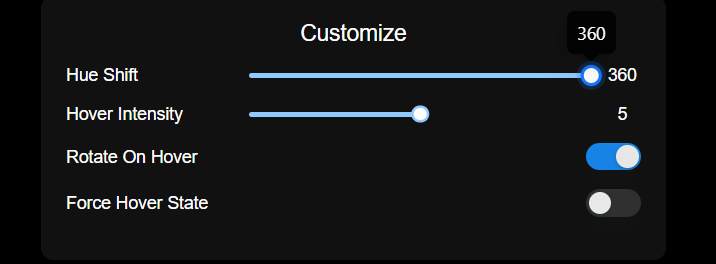

# SplashScreen Component

The `SplashScreen` component is a visually engaging introductory screen designed to provide users with an immersive experience as your application loads. Built with TypeScript and React, it features dynamic animations and customization options to match your app's branding.


---

## ✨ Features
🌈 Customizable Visual Effects: Adjust hue shift, hover intensity, and animations.
🎨 Sleek UI: Uses Ant Design for a professional interface.
🚀 Electron-Powered: Works as a standalone desktop application.
⚛ React-Based: Utilizes React with TypeScript for maintainability.
⚡ Fast & Lightweight: Optimized for performance.

- **Customizable Logo or Title**: Easily integrate your app's logo or name.
- **Dynamic Animations**: Offers animated elements for a polished user experience.
- **Customizable Timer**: Configure the duration of the splash screen.
- **Prop-Based Design**: Flexible props to adjust text, styling, and functionality.
- **Responsiveness**: Adapts to various screen sizes and resolutions.
- **Optional Loader**: Add a loading indicator for user feedback during initialization.

---



## Installation

To use the `SplashScreen` component, follow these steps:

1. Install [React](https://reactjs.org/) if you haven't already.
2. Clone or copy the `SplashScreen` component into your project.

---

## Usage

Here's an example of how to use the `SplashScreen` component in your application:

```tsx
import SplashScreen from "./SplashScreen";

function App() {
  return (
    <>
      <SplashScreen
        hoverIntensity={hoverIntensity}
        rotateOnHover={rotateOnHover}
        hue={hueShift}
        forceHoverState={forceHover}
        message="HELLO"
        widthSize={1200}
        heightSize={500}
      />
  );
}

export default App;
```

---

## Props

The `SplashScreen` component includes the following props for customization:

| Prop         | Type          | Default Value       | Description                                                  |
|--------------|---------------|---------------------|--------------------------------------------------------------|
| `logo`       | `string`      | `undefined`         | Path to the app logo or image.                               |
| `message`    | `string`      | `"Loading..."`      | Text to display on the splash screen.                        |
| `duration`   | `number`      | `3000`              | Duration (in milliseconds) the splash screen is shown.       |
| `onComplete` | `() => void`  | `() => {}`          | Callback triggered after the splash screen completes.        |
| `background` | `string`      | `"#ffffff"`         | Background color of the splash screen.                       |

---
## 🛠️ Technologies Used

- **Electron** - Desktop application framework
- **React** - UI library
- **Ant Design** - UI components
- **TypeScript** - Type-safe JavaScript
- **Vite** - Fast build tool for modern web apps

---

## Customization

### Dynamic Logo
Pass a custom logo through the `logo` prop to display your app's branding.

### Custom Message
You can update the message text via the `message` prop.

### Styling
Customize the appearance of the SplashScreen using props or edit its styles in the accompanying CSS file.

---

## Development

If you want to modify or enhance the `SplashScreen` component, follow these steps:

1. Clone the repository.
2. Install dependencies:
   ```bash
   npm install
   ```
3. Run the development server:
   ```bash
   npm start
   ```
4. Modify the source code to add new features or adjust styles.

---

## Dependencies

- [React](https://reactjs.org/) for building UI components.
- Optional: Animation libraries like [Framer Motion](https://www.framer.com/motion/) for smoother transitions.

---
## 🖥️ UI Customization

The app allows users to tweak visual effects:

| Feature             | Description |
|---------------------|-------------|
| **Hue Shift**       | Adjust color hue of elements |
| **Hover Intensity** | Controls the animation strength |
| **Rotate on Hover** | Enables/disables rotation on hover |
| **Force Hover State** | Keeps hover effects active |


---

## 🏗️ Folder Structure

```
/your-repo
├── /src
│   ├── /components      # Reusable UI components
│   ├── /renderer        # React UI logic
│   ├── /main            # Electron main process
│   ├── index.tsx        # React entry point
├── package.json         # Project dependencies
├── electron.js          # Electron setup
├── README.md            # This file
```

---

## 🔧 Build & Package

To package the app for distribution:

```bash
npm run electron:package
```

This will generate the executable files for Windows, macOS, or Linux.

---

## 📜 License

This project is licensed under the **MIT License**.

---

## 🙌 Contributing

We welcome contributions! Feel free to submit issues or pull requests.

## License

This project is open-source and available under the MIT License. Feel free to use, modify, and distribute it.

---

## Contribution

We welcome contributions! If you have ideas for new features or find any issues, feel free to open a pull request or file an issue.

---

## Acknowledgments

Thank you to the open-source community for inspiring the development of this SplashScreen component.
```

This `README.md` focuses on a `SplashScreen` component and emphasizes its purpose, features, and customization. Let me know if you need me to adjust it further! 🚀
